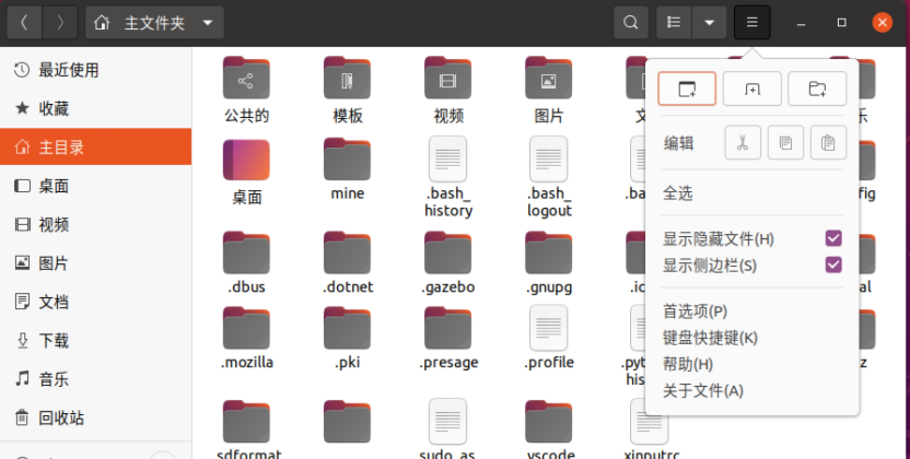
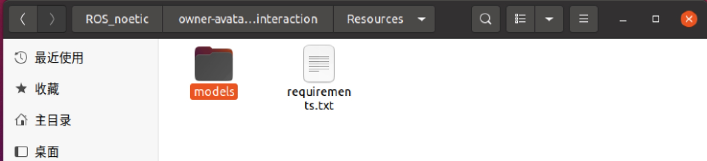
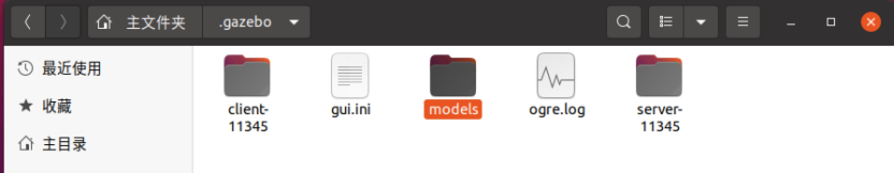
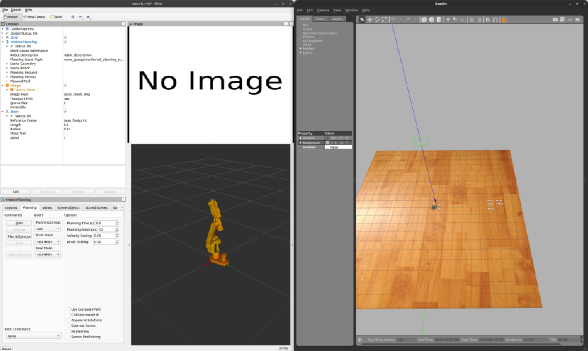
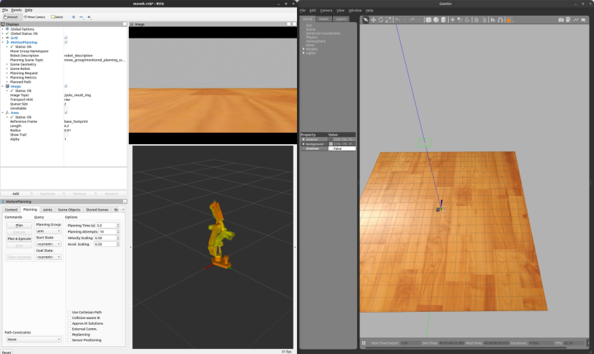
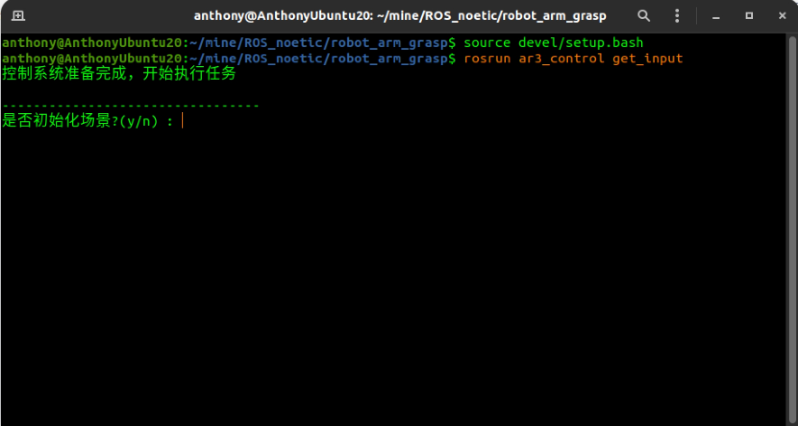
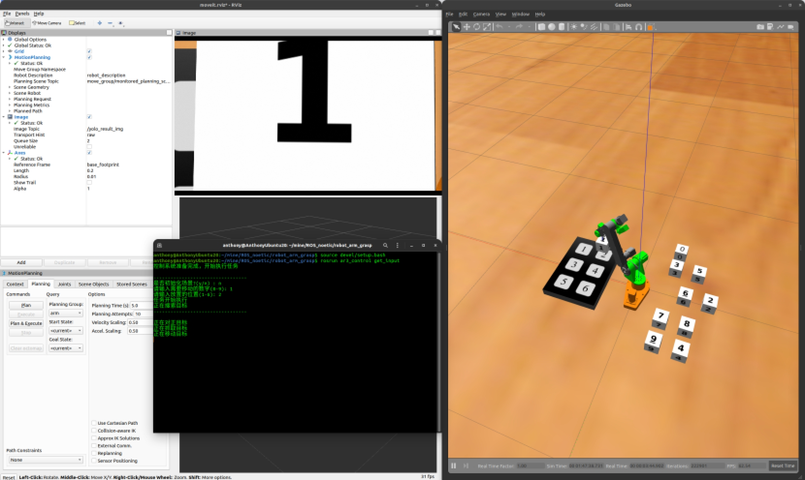
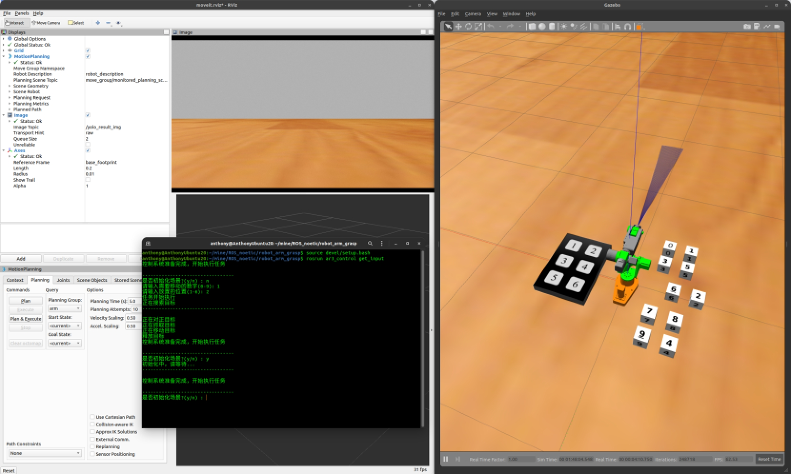

# robot_arm

## **项目运行环境**

ubuntu20.04

ros-noetic

虚拟机可能带来较长的图像识别推理时间，导致任务无法执行 

 

## **配置环境**

进入项目文件夹，在文件夹下打开终端，依次输入以下3条语句，确保无报错：

sudo apt install ros-noetic-moveit ros-noetic-joint-trajectory-controller ros-noetic-moveit-core ros-noetic-moveit-ros-planning ros-noetic-moveit-ros-planning-interface

 

pip install -r Resources/requirements.txt

 

catkin_make

 

打开显示隐藏文件夹的开关：

 

 

进入将Resources文件夹中的models文件夹复制到主文件下的.gazebo文件夹，进行合并

 

 

 

## **运行程序**

在项目文件夹下打开第一个终端，依次运行：

source devel/setup.bash

roslaunch ar3_control moveit_gazebo.launch

运行成功后会启动Gazebo和rviz：

 

 

然后再在项目文件夹下打开另外一个终端，依次输入：

source devel/setup.bash

roslaunch ar3_control ar3_yolo_controller.launch 

运行后rviz中摄像机图像将会出现，机械臂会回到初始位置

 

 

 

在项目文件夹下再打开另外一个终端，依次输入：

source devel/setup.bash

rosrun ar3_control get_input

 

运行后会输出内容：

 

 

之后在，当前终端中进行交互，机械臂会按照命令执行动作：

 

 

选择初始化场景，模型会回到初始位置：

 

 

至此，项目复刻完成。